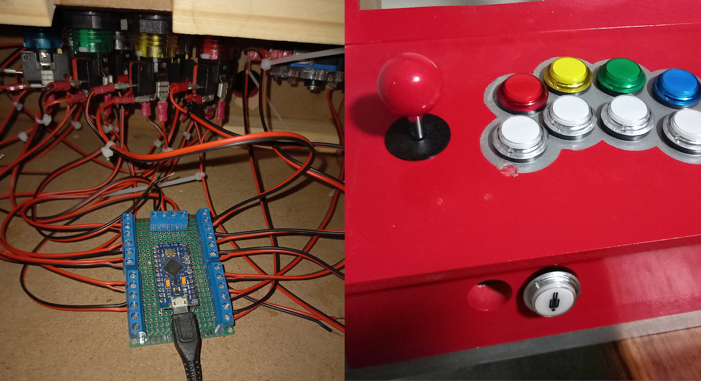
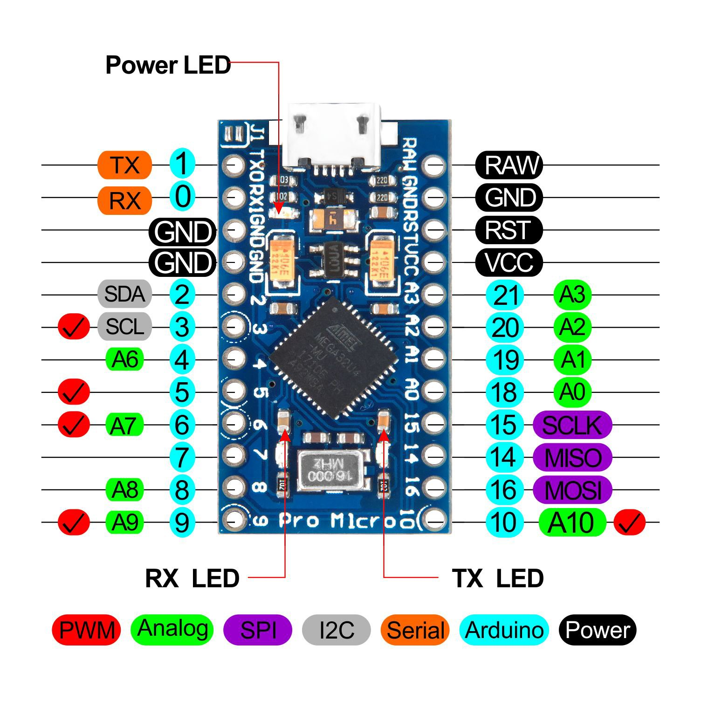

# Arcade Gamepad built on Arduino Pro Micro (Leonardo)

Verify that the Arduino is configured correctly using `jstest`:

    $ justest /dev/input/js0

## Troubleshooting

### Bricked Chinese Pro Micro

I soft "bricked" my fake Pro Micros a few times while uploading code to them, to unbrick them, we can simply burn the Arduino Leonardo boot loader to them using an Arduino Uno as an ISP, see (here)[https://eldontronics.wordpress.com/2019/06/16/arduino-pro-micro-clone-port-not-detected/].